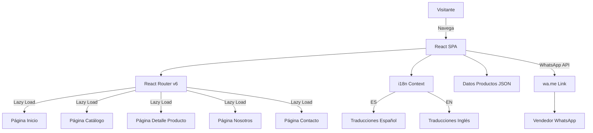
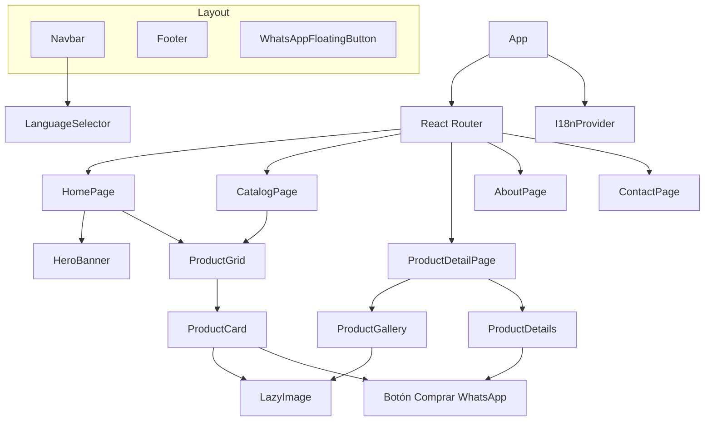

# Documento de Diseño: Tienda de Esmeraldas Colombianas

## Resumen General

Este documento describe el diseño técnico de un sitio web profesional para la venta de esmeraldas colombianas, construido con React JS. El sitio será una Single Page Application (SPA) bilingüe (español/inglés) con un diseño elegante que utiliza tonos de verde esmeralda y dorado. Los visitantes podrán explorar un catálogo de esmeraldas con imágenes de alta calidad y contactar al vendedor directamente a través de WhatsApp para concretar compras.

### Decisiones Técnicas Clave

- **React + Vite**: Se utiliza Vite como bundler por su velocidad de desarrollo y soporte nativo para code splitting.
- **React Router v6**: Enrutamiento del lado del cliente con carga diferida (lazy loading) por rutas.
- **react-i18next**: Librería estándar de internacionalización para React, con soporte para cambio de idioma sin recarga.
- **CSS Modules**: Estilos con alcance local por componente, evitando conflictos de nombres.
- **Intersection Observer API**: Para lazy loading nativo de imágenes sin dependencias externas.
- **Datos estáticos en JSON**: El catálogo de productos se almacena en archivos JSON con traducciones integradas, sin necesidad de backend.

## Arquitectura

### Diagrama de Arquitectura General



### Patrón de Arquitectura

La aplicación sigue una arquitectura basada en componentes con las siguientes capas:

1. **Capa de Presentación**: Componentes React organizados por páginas y componentes reutilizables.
2. **Capa de Estado**: React Context para el idioma y datos de configuración.
3. **Capa de Datos**: Archivos JSON estáticos para productos y traducciones.
4. **Capa de Servicios**: Utilidades para formateo de precios y generación de enlaces WhatsApp.

### Estructura del Proyecto

```
colombian-emeralds-store/
├── public/
│   └── images/
│       ├── products/          # Fotos de esmeraldas
│       ├── banners/           # Imágenes de banner
│       └── icons/             # Íconos y logotipo
├── src/
│   ├── components/
│   │   ├── layout/
│   │   │   ├── Navbar.jsx
│   │   │   ├── Footer.jsx
│   │   │   └── WhatsAppFloatingButton.jsx
│   │   ├── product/
│   │   │   ├── ProductCard.jsx
│   │   │   ├── ProductGrid.jsx
│   │   │   ├── ProductGallery.jsx
│   │   │   └── ProductDetails.jsx
│   │   ├── ui/
│   │   │   ├── LanguageSelector.jsx
│   │   │   ├── HeroBanner.jsx
│   │   │   ├── LazyImage.jsx
│   │   │   └── PlaceholderImage.jsx
│   │   └── common/
│   │       └── ScrollAnimation.jsx
│   ├── pages/
│   │   ├── HomePage.jsx
│   │   ├── CatalogPage.jsx
│   │   ├── ProductDetailPage.jsx
│   │   ├── AboutPage.jsx
│   │   └── ContactPage.jsx
│   ├── i18n/
│   │   ├── i18n.js              # Configuración de i18next
│   │   ├── locales/
│   │   │   ├── es.json          # Traducciones español
│   │   │   └── en.json          # Traducciones inglés
│   ├── data/
│   │   └── products.json        # Catálogo de productos
│   ├── config/
│   │   └── site.js              # Configuración centralizada (WhatsApp, colores, etc.)
│   ├── services/
│   │   ├── whatsapp.js          # Generación de enlaces WhatsApp
│   │   └── formatPrice.js       # Formateo de precios en COP
│   ├── hooks/
│   │   ├── useLanguage.js       # Hook para gestión de idioma
│   │   └── useLazyLoad.js       # Hook para Intersection Observer
│   ├── styles/
│   │   ├── variables.css        # Variables CSS (colores, espaciado, tipografía)
│   │   └── global.css           # Estilos globales
│   ├── App.jsx
│   └── main.jsx
├── index.html
├── vite.config.js
└── package.json
```

## Componentes e Interfaces

### Componentes Principales

#### 1. Navbar
Barra de navegación fija superior con logotipo, enlaces de sección y selector de idioma.

```jsx
// Props
interface NavbarProps {
  // Sin props - usa i18n context internamente
}

// Comportamiento:
// - Fija en la parte superior (position: sticky)
// - En móvil: menú hamburguesa con panel deslizable
// - Contiene: logo, enlaces (Inicio, Catálogo, Nosotros, Contacto), LanguageSelector
```

#### 2. LanguageSelector
Componente para alternar entre español e inglés.

```jsx
// Props
interface LanguageSelectorProps {
  // Sin props - usa i18n context internamente
}

// Comportamiento:
// - Muestra banderas o códigos (ES/EN) como botones
// - Al hacer clic, cambia el idioma globalmente via i18next
// - Persiste la selección en la sesión (sin localStorage, solo estado en memoria)
```

#### 3. ProductCard
Tarjeta individual de producto en el catálogo.

```jsx
interface ProductCardProps {
  product: Product;
  onViewDetails: (productId: string) => void;
}

// Comportamiento:
// - Muestra imagen (con lazy loading), nombre, descripción breve, quilates, precio formateado
// - Efecto hover de elevación (transform + box-shadow)
// - Clic en tarjeta → navega a detalle del producto
// - Botón "Comprar por WhatsApp" → abre enlace wa.me
```

#### 4. ProductGallery
Galería de imágenes para la vista detallada del producto.

```jsx
interface ProductGalleryProps {
  images: string[];
  productName: string;
}

// Comportamiento:
// - Muestra imagen principal grande
// - Controles anterior/siguiente para navegar entre imágenes
// - Miniaturas debajo de la imagen principal
// - Imagen placeholder si no hay imágenes disponibles
```

#### 5. LazyImage
Componente de imagen con carga diferida usando Intersection Observer.

```jsx
interface LazyImageProps {
  src: string;
  alt: string;
  placeholderSrc?: string;
  className?: string;
  aspectRatio?: string;
}

// Comportamiento:
// - Muestra placeholder hasta que la imagen entra en el viewport
// - Usa IntersectionObserver para detectar visibilidad
// - Transición suave de placeholder a imagen real
// - Si la imagen falla, muestra PlaceholderImage elegante
```

#### 6. WhatsAppFloatingButton
Botón flotante de WhatsApp visible en todas las páginas.

```jsx
// Props
interface WhatsAppFloatingButtonProps {
  // Sin props - usa config y i18n internamente
}

// Comportamiento:
// - Posición fija en esquina inferior derecha
// - Ícono de WhatsApp con animación sutil de pulso
// - Al hacer clic → abre wa.me con mensaje genérico en idioma actual
```

#### 7. HeroBanner
Sección hero de la página de inicio.

```jsx
// Props
interface HeroBannerProps {
  // Sin props - usa i18n context internamente
}

// Comportamiento:
// - Imagen de fondo de gran tamaño
// - Título y subtítulo superpuestos con tipografía serif
// - Botón CTA que navega al catálogo
```

#### 8. ScrollAnimation
Wrapper para animaciones de entrada al hacer scroll.

```jsx
interface ScrollAnimationProps {
  children: React.ReactNode;
  animation?: 'fadeIn' | 'slideUp' | 'slideLeft';
  delay?: number;
}

// Comportamiento:
// - Usa IntersectionObserver para detectar cuando el elemento entra en viewport
// - Aplica clase CSS de animación al ser visible
// - Ejecuta la animación una sola vez
```

### Diagrama de Componentes



## Modelos de Datos

### Producto (Product)

```json
{
  "id": "esmeralda-muzo-001",
  "images": [
    "/images/products/muzo-001-main.webp",
    "/images/products/muzo-001-side.webp",
    "/images/products/muzo-001-detail.webp"
  ],
  "carats": 2.5,
  "priceInCOP": 2500000,
  "cut": "oval",
  "clarity": "AAA",
  "origin": "Muzo, Boyacá",
  "name": {
    "es": "Esmeralda Muzo Ovalada",
    "en": "Muzo Oval Emerald"
  },
  "shortDescription": {
    "es": "Esmeralda natural de 2.5 quilates con corte ovalado y claridad excepcional.",
    "en": "Natural 2.5 carat emerald with oval cut and exceptional clarity."
  },
  "fullDescription": {
    "es": "Esmeralda natural extraída de las minas de Muzo, Boyacá...",
    "en": "Natural emerald extracted from the Muzo mines, Boyacá..."
  }
}
```

### Configuración del Sitio (SiteConfig)

```javascript
// src/config/site.js
export const siteConfig = {
  whatsapp: {
    phoneNumber: "573001234567", // Número en formato internacional sin +
    messages: {
      es: {
        greeting: "¡Hola! Estoy interesado en sus esmeraldas colombianas.",
        product: (name, price) =>
          `¡Hola! Estoy interesado en: ${name} - Precio: $${price} COP`
      },
      en: {
        greeting: "Hello! I'm interested in your Colombian emeralds.",
        product: (name, price) =>
          `Hello! I'm interested in: ${name} - Price: $${price} COP`
      }
    }
  },
  colors: {
    emeraldDark: "#046A38",
    emeraldLight: "#50C878",
    gold: "#D4AF37",
    white: "#FFFFFF"
  }
};
```

### Estructura de Traducciones (i18n)

```json
// src/i18n/locales/es.json
{
  "nav": {
    "home": "Inicio",
    "catalog": "Catálogo",
    "about": "Nosotros",
    "contact": "Contacto"
  },
  "hero": {
    "title": "Esmeraldas Colombianas de Clase Mundial",
    "subtitle": "Directamente desde las minas de Colombia a sus manos",
    "cta": "Ver Catálogo"
  },
  "product": {
    "carats": "Quilates",
    "cut": "Corte",
    "clarity": "Claridad",
    "origin": "Origen",
    "buyWhatsApp": "Comprar por WhatsApp"
  },
  "contact": {
    "title": "Contáctenos",
    "location": "Colombia",
    "whatsappChat": "Chatear por WhatsApp"
  },
  "footer": {
    "rights": "Todos los derechos reservados"
  }
}
```

### Formato de Precio

```javascript
// src/services/formatPrice.js
// Entrada: 2500000 (número)
// Salida: "$2.500.000 COP" (string)
// Reglas:
// - Prefijo "$"
// - Separador de miles: punto "."
// - Sin decimales
// - Sufijo " COP"
```

### Generación de Enlace WhatsApp

```javascript
// src/services/whatsapp.js
// Formato: https://wa.me/{phoneNumber}?text={encodedMessage}
// - phoneNumber: número en formato internacional sin "+"
// - text: mensaje URL-encoded
// - Se abre en nueva pestaña (target="_blank")
```

## Propiedades de Correctitud

*Una propiedad es una característica o comportamiento que debe mantenerse verdadero en todas las ejecuciones válidas de un sistema — esencialmente, una declaración formal sobre lo que el sistema debe hacer. Las propiedades sirven como puente entre especificaciones legibles por humanos y garantías de correctitud verificables por máquinas.*

### Propiedad 1: Completitud de traducciones

*Para cualquier* clave de traducción presente en el archivo de español (`es.json`), debe existir una clave correspondiente en el archivo de inglés (`en.json`) y viceversa, y ambos valores deben ser cadenas no vacías.

**Valida: Requisitos 2.2**

### Propiedad 2: Visualización bilingüe de productos

*Para cualquier* producto del catálogo y cualquier idioma soportado (es/en), el nombre y la descripción del producto deben tener un valor no vacío en ese idioma.

**Valida: Requisitos 2.5**

### Propiedad 3: Campos requeridos en Tarjeta de Producto

*Para cualquier* producto válido, al renderizar su ProductCard, el resultado debe contener: la imagen (o placeholder), el nombre del producto, la descripción breve, el peso en quilates, el precio formateado en COP y el botón de compra por WhatsApp.

**Valida: Requisitos 3.2**

### Propiedad 4: Formateo de precios en COP

*Para cualquier* número entero no negativo como precio, la función `formatPrice` debe producir una cadena que comience con "$", use puntos como separadores de miles y termine con " COP". Además, parsear el resultado de vuelta (removiendo "$", puntos y " COP") debe devolver el número original.

**Valida: Requisitos 3.3**

### Propiedad 5: Generación de enlace WhatsApp con información del producto

*Para cualquier* nombre de producto y precio, la función de generación de enlace WhatsApp debe producir una URL que comience con `https://wa.me/` seguido del número configurado, y cuyo parámetro `text` decodificado contenga tanto el nombre del producto como el precio.

**Valida: Requisitos 4.1, 4.2**

### Propiedad 6: Mensaje de saludo WhatsApp en idioma correcto

*Para cualquier* idioma soportado (es/en), el enlace de WhatsApp generado para contacto general debe contener el mensaje de saludo configurado para ese idioma específico.

**Valida: Requisitos 7.2, 7.4**

### Propiedad 7: Imagen placeholder ante fallo de carga

*Para cualquier* fuente de imagen que falle al cargar, el componente LazyImage debe mostrar la imagen de marcador de posición sin afectar la disposición visual (manteniendo las mismas dimensiones del contenedor).

**Valida: Requisitos 5.2, 8.4**

### Propiedad 8: Navegación de galería ida y vuelta

*Para cualquier* arreglo de imágenes con longitud mayor a 1, navegar hacia adelante N pasos y luego hacia atrás N pasos en la galería debe retornar a la imagen original (índice 0).

**Valida: Requisitos 5.4**

## Manejo de Errores

### Errores de Carga de Imágenes
- Cuando una imagen de producto no se puede cargar (404, timeout, error de red), el componente `LazyImage` captura el evento `onError` y reemplaza la fuente con la imagen placeholder.
- La imagen placeholder tiene un diseño elegante con el ícono de una esmeralda estilizada y texto "Imagen no disponible".
- El contenedor mantiene su relación de aspecto fija para evitar saltos de layout (CLS).

### Errores de Formato WebP
- El componente `LazyImage` usa el elemento `<picture>` con `<source type="image/webp">` y un `` de respaldo en JPEG.
- Si el navegador no soporta WebP, automáticamente usa la imagen JPEG de respaldo.

### Producto No Encontrado
- Si un visitante navega a una URL de producto que no existe en el catálogo, la página de detalle muestra un mensaje amigable "Producto no encontrado" con un enlace de regreso al catálogo.

### Errores de Internacionalización
- Si una clave de traducción no se encuentra, `react-i18next` muestra la clave como texto de respaldo, evitando pantallas en blanco.
- Los datos de producto siempre incluyen ambos idiomas; si falta una traducción de producto, se muestra el texto en español como respaldo.

### Enlace WhatsApp Inválido
- Si el número de WhatsApp no está configurado correctamente, el botón de compra muestra un mensaje de error en lugar de generar un enlace roto.
- La función `generateWhatsAppUrl` valida el formato del número antes de construir la URL.

## Estrategia de Pruebas

### Enfoque Dual de Pruebas

La estrategia combina pruebas unitarias basadas en ejemplos con pruebas basadas en propiedades para lograr cobertura integral.

### Pruebas Unitarias (Ejemplos y Casos Específicos)

**Framework**: Vitest + React Testing Library

1. **Componentes de Layout**: Verificar que Navbar, Footer y WhatsAppFloatingButton renderizan los elementos esperados.
2. **Navegación Responsiva**: Verificar menú hamburguesa en viewport móvil y menú completo en escritorio.
3. **Selector de Idioma**: Verificar que al cambiar idioma se actualiza el contenido visible.
4. **Página de Detalle**: Verificar navegación desde ProductCard a ProductDetailPage con datos correctos.
5. **Hover en ProductCard**: Verificar que las clases CSS de elevación se aplican correctamente.
6. **Configuración**: Verificar que `siteConfig` exporta los campos requeridos.
7. **Formato WebP con respaldo**: Verificar que LazyImage genera elemento `<picture>` con source WebP e img JPEG.

### Pruebas Basadas en Propiedades (Property-Based Testing)

**Framework**: [fast-check](https://github.com/dubzzz/fast-check) con Vitest

Cada propiedad del documento de diseño se implementa como una prueba basada en propiedades con un mínimo de 100 iteraciones.

| Propiedad | Descripción | Generadores |
|-----------|-------------|-------------|
| Propiedad 1 | Completitud de traducciones | Claves aleatorias de los archivos de traducción |
| Propiedad 2 | Visualización bilingüe de productos | Productos aleatorios × idiomas |
| Propiedad 3 | Campos requeridos en ProductCard | Productos aleatorios válidos |
| Propiedad 4 | Formateo de precios en COP (round-trip) | Enteros no negativos aleatorios |
| Propiedad 5 | Enlace WhatsApp con info de producto | Nombres y precios aleatorios |
| Propiedad 6 | Saludo WhatsApp en idioma correcto | Idiomas aleatorios (es/en) |
| Propiedad 7 | Placeholder ante fallo de imagen | URLs de imagen aleatorias que fallan |
| Propiedad 8 | Navegación de galería ida y vuelta | Arreglos de imágenes aleatorios + N pasos aleatorios |

**Formato de etiqueta para cada prueba**:
```
// Feature: colombian-emeralds-store, Property 4: Formateo de precios en COP
```

### Pruebas de Integración

1. **Flujo de compra completo**: Navegar al catálogo → seleccionar producto → verificar que el enlace WhatsApp se genera correctamente.
2. **Cambio de idioma end-to-end**: Cambiar idioma → navegar entre páginas → verificar que todo el contenido se muestra en el idioma seleccionado.
3. **Lazy loading de imágenes**: Verificar que las imágenes solo se cargan cuando entran en el viewport (mock de IntersectionObserver).

### Pruebas de Humo (Smoke Tests)

1. Verificar que la aplicación se renderiza sin errores.
2. Verificar que el idioma predeterminado es español.
3. Verificar que la configuración de WhatsApp está presente.
4. Verificar que las variables CSS contienen los colores especificados.
